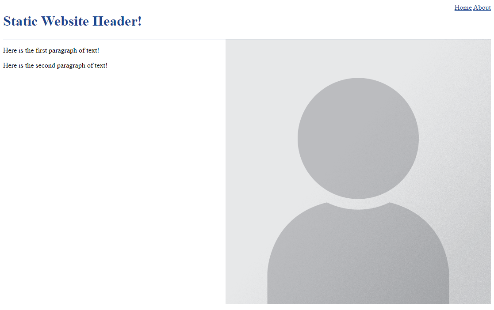

# Example HTML CSS and JS
##### _Boilerplate HTML, CSS and JS for beginners_

This repository is a basic template for creating a simple website.

Forking this repo should give you everything you need to get something basic online, hosted under GitHub Pages.

## Features
- Starter Website template in plain HTML/CSS/JS
- Automatic Deployments to GitHub Pages with GitHub Actions
- Automatic deployment with GitHub Actions

## Help
 - [Getting started](./assets/help/getting-started.md)
 - [Updating your website (Deploying)](./assets/help/deploying.md)
 - [Adding a new page](./assets/help/adding-a-new-page.md)
 - [Making an app for your website (Flutter)](./assets/help/flutter.md)
 - [Publishing your app (Deploying)](./assets/deploying-flutter.md)
 - [Glossary](./assets/help/glossary.md)

## Screenshot
[https://andrewiankidd.github.io/example-html-css-js/](https://andrewiankidd.github.io/example-html-css-js/)
